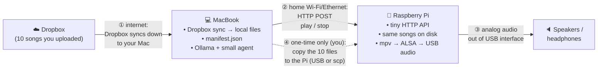
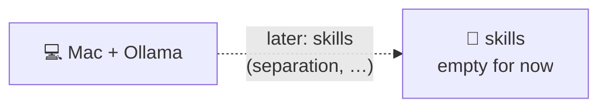

# Music agent orchestration (v0)

**Working title:** `music-agent-orchestration` — rename this folder or a future standalone repo if you pick a final product name.

Local-first experiment: a **small agent on a MacBook** (Ollama) chooses what to play; a **Raspberry Pi** plays audio over **USB → ALSA** to speakers. **~10 tracks** live in **Dropbox** for a cloud-backed test; the Pi holds **local copies** of the same files for v0.

**Status:** architecture and docs only — implementation can follow in small steps. Safe to use as a checkpoint if work is interrupted.

## Goals (v0)

- **MacBook:** Ollama (local LLM), thin orchestrator, `manifest.json` next to synced Dropbox files.
- **Pi:** Minimal **HTTP API** (`play` / `stop`), **mpv** (or similar) → **ALSA** → USB audio interface.
- **LAN:** Mac calls Pi over HTTP (simplest control path).
- **Single user**, home network.
- **Skills** (source separation, remix, etc.): **out of scope for v0** (reserved for later).

## Non-goals (v0)

- No multi-user auth.
- No 10M-scale catalog / search index yet.
- No Dropbox OAuth / headless Pi fetch required for the first iteration (optional later).
- No DSP “skills” pipeline yet.

## Architecture



| # | Direction | Meaning |
|---|-----------|--------|
| ① | Cloud → Mac | Dropbox **desktop app** keeps a folder on the Mac updated. |
| ② | Mac → Pi | Agent sends **HTTP** commands to the Pi on the LAN. |
| ③ | Pi → room | **USB audio interface** outputs to speakers/headphones. |
| ④ | Manual (dashed) | **v0:** copy the same 10 files to the Pi once (USB stick or `scp`); not auto-sync yet. |

### Optional “later” sketch



## Hardware / software assumptions

| Piece | Notes |
|--------|--------|
| **MacBook Pro** (e.g. 16 GB RAM) | Runs **Ollama** locally; runs orchestrator + HTTP client to Pi. |
| **Raspberry Pi** | Runs HTTP server + player; holds local audio files. |
| **USB audio interface on Pi** | Playback via ALSA; document a stable device name when implementing. |
| **Dropbox** | Test library of **~10 manually uploaded** tracks; synced to Mac via Dropbox app. |
| **Home LAN** | Mac and Pi reachable to each other (hostname or static IP helps). |

## Suggested repo layout (implementation)

```text
music-agent-orchestration/
  README.md                 # this file
  manifest.example.json     # track_id, title, filename, path-on-pi
  mac/                      # orchestrator + Ollama client + Pi HTTP client
  pi/                       # FastAPI/Flask + play/stop + subprocess to mpv
  docs/
    architecture.md         # optional deeper notes
```

## Environment variables (placeholder)

Define when coding, for example:

- `PI_PLAYER_BASE_URL` — `http://<pi-host>:<port>`
- `MANIFEST_PATH` — path to `manifest.json` on the Mac
- `OLLAMA_HOST` — default `http://127.0.0.1:11434`

## Security note (v0)

Bind the Pi HTTP server to **LAN only** or use an **SSH tunnel** if you do not want the player API exposed broadly. Single-user home lab is the assumed threat model.

## Roadmap (after v0)

- Dropbox **API** (signed URLs / headless fetch) so the Pi can pull without manual copy.
- **Skills** plane (source separation, remix) as separate jobs + artifacts.
- Catalog **index** story if the library grows large.

## Relationship to this repository

This folder lives in the canonical **[Raspberri_Pi_Audio](https://github.com/jeremybboy/Raspberri_Pi_Audio)** tree (alongside BPM/OLED work). A **mirror** may also exist under `experiments/05-raspberriPITests/music-agent-orchestration/` in [gpu-audio-lab](https://github.com/jeremybboy/gpu-audio-lab) for lab workflows; keep wording in sync when you change architecture docs.

## Interrupt / resume

If work stops here: **this README + the Mermaid diagrams** are the source of truth. Next implementation steps are usually: **(1)** `manifest.json` + 10 files on Mac, **(2)** Pi HTTP `play` / `stop` + local paths, **(3)** Mac script that calls Ollama and then POSTs to the Pi.

## License

Follow the license of this **Raspberri_Pi_Audio** repository.
