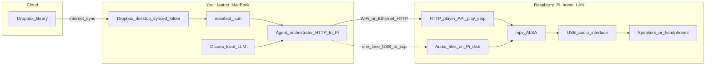

# Music agent orchestration — architecture

This document mirrors the **diagram-aligned v0** layout (Cloud, MacBook, Raspberry Pi). Export this diagram as PNG/SVG from [mermaid.live](https://mermaid.live) by pasting the fenced `mermaid` body only.

## Target architecture (v0)

## Implementation mapping

| Region | Role in code |
|--------|----------------|
| Cloud | Dropbox only; no service in v0. |
| Laptop | `mac/orchestrator_cli.py` reads `manifest.json`, optional Ollama, HTTP to Pi. |
| Raspberry Pi | `pi/player_server.py` (FastAPI), `manifest.json` on disk, `mpv` subprocess. |

See [../README.md](../README.md) for runbook and curl examples.
