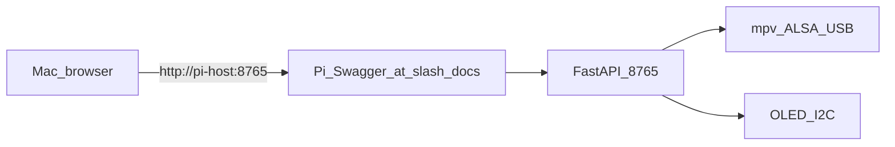

# V0.0 operator guide — run, visualize, test, add tracks

Single-page reference for **GitHub** and day-to-day use: how to **start the Pi player**, **control it from a Mac** (browser or shell), **run tests**, and **add songs**.

---

## Flow (what talks to what)



Audio is heard **on the Pi** (USB interface → speakers/headphones), not on the Mac speakers.

---

## Start the player (always on the Raspberry Pi)

Run **`uvicorn`** from this folder so imports resolve (`pi.*`):

```bash
cd /path/to/Raspberri_Pi_Audio/music-agent-orchestration/v0_0
/path/to/.venv/bin/python -m uvicorn pi.player_server:app --host 0.0.0.0 --port 8765
```

Use the repo [`.venv`](../../.venv) path on your Pi, or another venv with `requirements-pi.txt` installed.

---

## Control from the Mac (visual first)

| Goal | What to do on the Mac |
|------|------------------------|
| **Play / stop with buttons** | Open **`http://<pi-hostname-or-ip>:8765/`** in a browser. You are redirected to **Swagger UI** (`/docs`). Use **Try it out** on **`POST /play`** with JSON body `{"track_id": "<id_from_manifest>"}`, then **`POST /stop`**. |
| **Status JSON only** | Open **`http://<pi-host>:8765/health`** in the address bar. |
| **Refresh OLED idle line** | Open **`http://<pi-host>:8765/health?oled=1`**. |

Use your Pi’s LAN hostname (e.g. **`jeremybboy.local`**) or IP instead of `<pi-host>`.

---

## Same actions from the terminal (Mac or Pi)

Set the base URL once:

```bash
export PI_BASE_URL=http://jeremybboy.local:8765
# or: export PI_BASE_URL=http://192.168.x.x:8765
```

From anywhere in a clone, using the helper script:

```bash
bash music-agent-orchestration/v0_0/mac/pi_player.sh health
bash music-agent-orchestration/v0_0/mac/pi_player.sh play 'que_maravilla'
bash music-agent-orchestration/v0_0/mac/pi_player.sh stop
```

Equivalent **`curl`**:

```bash
curl -sS "$PI_BASE_URL/health"
curl -sS -X POST "$PI_BASE_URL/play" -H 'Content-Type: application/json' -d '{"track_id":"que_maravilla"}'
curl -sS -X POST "$PI_BASE_URL/stop"
```

---

## Add a new song

| Step | Action |
|------|--------|
| 1 | Copy the audio file onto the Pi under **`~/music-agent/media/`** (default `MEDIA_ROOT`). Example from Mac: `scp "/path/to/Song.mp3" uzan@<pi-host>:~/music-agent/media/` |
| 2 | Prefer **no spaces** in the filename on disk (e.g. `Song.mp3`) to avoid shell/JSON mistakes. |
| 3 | Edit **`music-agent-orchestration/v0_0/manifest.json`** on the Pi and add a track object: **`id`** (this is the **`track_id`** you send in **`/play`**), **`title`** (OLED line), **`filename`** (must match the file name under `MEDIA_ROOT`). |
| 4 | **Optional:** use **`path_on_pi`** with an absolute path on the Pi; it **overrides** **`filename`** when both are set. See [`pi/player_server.py`](pi/player_server.py) function `resolve_audio_path`. |
| 5 | Use Swagger or **`pi_player.sh play '<your_id>'`** to play. |

`manifest.json` is usually **local only** (ignored by git under `music-agent-orchestration/.gitignore`). Keep a backup or maintain [`manifest.example.json`](manifest.example.json) in the repo as a template.

**Demo WAVs on a fresh Pi:** from `v0_0/`, run `python scripts/setup_demo_media.py` then copy `manifest.example.json` to `manifest.json` if needed.

---

## Run tests (layers)

| Layer | What it checks | Command (from **`music-agent-orchestration/v0_0/`**) |
|-------|----------------|------------------------------------------------------|
| **1 — Automated** | HTTP API, manifest paths, mocked **`mpv`** | `pip install -r requirements-dev.txt` then `python -m pytest pi/tests -q` |
| **2 — Smoke** | You confirm **sound + OLED** while server runs on `127.0.0.1:8765` | `bash scripts/smoke_v0_0.sh` (interactive; prompts for `track_id`) |
| **3 — LAN** | Mac (or browser) → Pi over the network | Browser **`/docs`** or **`PI_BASE_URL`** + `pi_player.sh` / `curl` as above |

---

## Troubleshooting (short)

| Symptom | Likely cause |
|---------|----------------|
| Browser cannot open Pi URL | Pi off, wrong host, not same LAN, firewall, or **`uvicorn`** not bound to **`0.0.0.0:8765`**. |
| **`/`** or **`/docs`** fails | Server not running or wrong port. |
| **404** on **`/play`** | **`track_id`** does not match any **`id`** in **`manifest.json`**. |
| **400** missing file | **`filename`** wrong or file not under **`MEDIA_ROOT`**. |
| **200** but no sound | Wrong ALSA device for **`mpv`**; set **`MPV_OPTS`** (see main [`README.md`](README.md) env table). |
| OLED shows **`!no manifest`** | **`manifest.json`** missing at default path, or **`uvicorn`** was started from the **wrong directory** — always **`cd`** into **`v0_0`** before starting the server. |

---

## More context

- Full spec and steps: [`README.md`](README.md) in this folder.  
- Parent “full v0” vision (Dropbox + Ollama): [`../README.md`](../README.md).
