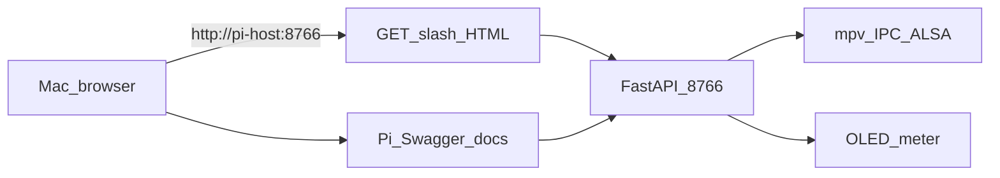
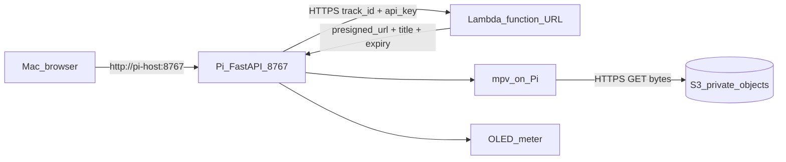

# V0.2 architecture — cloud presign flow

This document explains the transition from v0.1 to v0.2.

## v0.1 reference (local bytes on Pi)

## v0.2 target (catalog + auth in cloud)

## Why v0.2 is API-direct instead of HLS/DASH

v0.2 intentionally uses presigned single-object playback for simplicity:

- small catalog and fast validation of control flow
- minimal moving parts (no packaging pipeline, no segment ladder)
- clear security model (short-lived URLs + private bucket)

HLS/DASH remains a future milestone when adaptive bitrate, larger scale, and richer distribution requirements justify packaging complexity. See [`../docs/streaming-notes.md`](../docs/streaming-notes.md).
