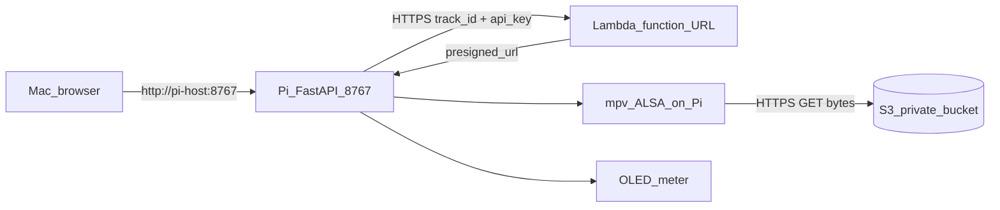

# V0.2 operator guide — Pi player + Lambda presign + S3

Single-page runbook for starting the Pi player, validating the cloud presign flow, and confirming playback.

**Default port:** **`8767`** (v0.1 can stay on 8766 side-by-side).

## Flow (what talks to what)



## Start the player on the Pi

Run from `v0_2` so `pi.*` imports resolve:

```bash
cd /home/uzan/Raspberri_Pi_Audio
source .venv/bin/activate
cd music-agent-orchestration/v0_2
cp .env.example .env.local
# edit .env.local with your real values (gitignored)
bash scripts/run_v0_2.sh
```

Equivalent without script:

```bash
set -a
source .env.local
set +a
python -m uvicorn pi.player_server:app --host 0.0.0.0 --port 8767
```

## Control from Mac

- Landing + buttons: `http://<pi-host>:8767/`
- Swagger: `http://<pi-host>:8767/docs`
- Tracks JSON (cloud-backed): `http://<pi-host>:8767/api/tracks`
- Health JSON: `http://<pi-host>:8767/health`

The landing page status area shows a trace for play flow:
- request to Pi
- Lambda presign response
- mpv launch with presigned URL preview

## Terminal helpers

```bash
export PI_BASE_URL=http://jeremybboy.local:8767
bash music-agent-orchestration/v0_2/mac/pi_player.sh health
bash music-agent-orchestration/v0_2/mac/pi_player.sh play 'que_maravilla'
bash music-agent-orchestration/v0_2/mac/pi_player.sh stop
```

## Recommended env vars

| Variable | Meaning |
|---|---|
| `LAMBDA_FUNCTION_URL` | Base URL for cloud API (required) |
| `CLOUD_API_KEY` | Shared key sent as `X-Api-Key` (required) |
| `CLOUD_HTTP_TIMEOUT_SECONDS` | Timeout for Pi→Lambda calls (default 8.0) |
| `TRACKS_CACHE_TTL_SECONDS` | `/api/tracks` cache TTL in seconds (default 45) |
| `V0_2_DEBUG_FULL_URL` | `1` to return full presigned URL in `/play` response |
| `PLAYBACK_METER_MODE` | Use `none` for cloud mode default; `ffmpeg` may probe URL and add traffic |

`.env.local` is not committed; keep real secrets there. `.env.example` is the committed template.

## Testing layers

1. Cloud endpoint smoke from laptop:
   - `GET /tracks`
   - `POST /play` with valid `track_id`
2. Pi local tests:
   - `cd music-agent-orchestration/v0_2 && python -m pytest pi/tests -q`
3. End-to-end:
   - open `http://<pi-host>:8767/`
   - press Play on one track
   - confirm sound from Pi USB output and trace details in UI
